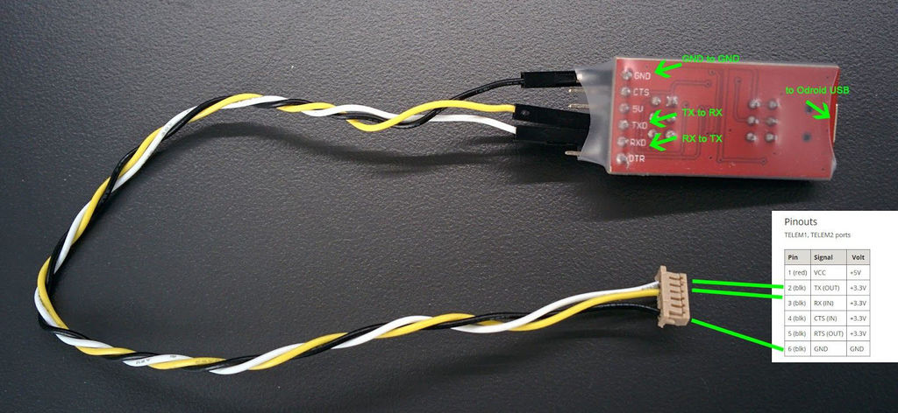

# What is this repo about
Just a few clues to find your way through the jungle.
by Simon Göldi @ ILT a HSR Institute

# Debug Pixhawk 2.1 and FTDI
The system console allows low-level access to the system, debug output and analysis of the system boot process. 

Connect the FTDI cable to the pins named CONS as follows:

**port parameters:** 57600 baud, 8 data bits, 1 stop bit

|Pin| |
|---|---|
|1 (next to cube)|Ground|
|2|TX|
|3|RX|

Further information can be found here: https://dev.px4.io/en/debug/system_console.html

# Getting Started with mavros

## Goal
Setting up a ROS System with a mavros bridge so that a pixhawk flight controller (FCU) can be connected to a companion computer with a ROS running.

## Wiring




## Setting up Linux computer
The following steps have to be completed for setting up a mavros connection with a pixhawk. First of all you need to install ***ROS***. A installation guide can be found [here](http://wiki.ros.org/kinetic/Installation/Ubuntu)

For installing ***mavros*** it is recommended to use the source installation as described [here](https://dev.px4.io/en/ros/mavros_installation.html)

### catkin workspace
If you already have a catkin workspace you can skip these section.
If not you can create one as follows:

```bash
$ mkdir -p ~/catkin_ws_mavros/src
$ cd ~/catkin_ws_mavros
$ catkin init
```
### Install ROS python tools
If you already have `python-wstool`, `python-rosinstall-generator` and ` python-catkin-tools` installed during the ROS installation you can skip these section. Otherwise you can also install them with:

```bash
$ sudo apt-get install python-wstool python-rosinstall-generator python-catkin-tools
```

### Install mavros package
If you have `ROS`, a directory for `catkin_ws` and `python-wstool`, `python-rosinstall-generator` and ` python-catkin-tools` installed you are ready to install the mavros bridge.

** 1. Getting the source: **

```bash
$ rosinstall_generator --upstream mavros | tee /tmp/mavros.rosinstall
```

** 2. Getting the latest Mavlink package**
```
$ rosinstall_generator mavlink | tee -a /tmp/mavros.rosinstall
```

** 3. Setup workspace & install deps**
```bash
$ wstool merge -t src /tmp/mavros.rosinstall
$ wstool update -t src
$ rosdep install --from-paths src --ignore-src --rosdistro `echo $ROS_DISTRO` -y
```

** 4. Build the mavros package**
```bash
$ catkin build
```

### Install Network Time Protocol Deamon (ntpd)
You have to install the `ntp` for synchronize time across computers with NTP servers.

```bash
$ sudo apt-get install ntp  
```

An other solution is [Chrony](https://chrony.tuxfamily.org/).  

---
## Setting up the pixhawk

### Telem2 as companion
First of all you have to activate a MAVLink stream on the Telem2 port with data streams specific to onboard mode. This can be achieved by setting the baud rate of the parameter `SYS_COMPANION = 921600`(recommended) or `SYS_COMPANION = 57600`. The easiest way for doing so is by connecting the pixhawk to QGroundControl (QGC) an navigate to the Paramterlist.


### Changing Stream Rate
At a baud rate of 921600 is the default mavlink stream rate as follows.

**TODO: List of the frequencies**

To change the stream rate of a specific MAVLink [Message](http://mavlink.org/messages/) you have two options.

**Option 1: Configuration with SD-Card (recommended for first setup)**
When booting the px4 Firmware loads some settings from the SD-Card. For configure the stream rate you have to add file `extras.txt` to the directory `/etc/` on the SD-Card and add the following lines.

```bash
mavlink stream -u <port number> -s <mavlink topic name> -r <rate>
```
- A list of `<mavlink topic name>` can be found [here](http://mavlink.org/messages/common/#HEARTBEAT) (*IMU:* `HIGHRES_IMU`)
- A list of `<port number>` can be found [here](). (*Telem2:* `/dev/ttyS2`, *USB:* `/dev/ttyACM0`)

**Example IMU:** For sending the high resolution IMU ([HIGHRES_IMU](http://mavlink.org/messages/common#HIGHRES_IMU))sensor data form the pixhawk Telem2 port at a stream rate of 120Hz you have to add the following line to the file `/etc/extras.txt` on the SD-Card.
```
 mavlink stream -d /dev/ttyS2 -s HIGHRES_IMU -r 120
```

---

## Usage
This section describes the usage of mavros in an example for getting the imu data of the pixhawk by sendig the Mavlink Stream over Telem 2 Port to an FTDI Converte to a USB socket on a linux computer.

### Find connected USB port
```bash
$ ls /dev/ttyUSB*
```

### start the ros Master
```bash
$ roscore
```
### Start the mvavros node:
```bash
$ roslaunch mavros px4.launch fcu_url:=serial:///dev/ttyUSB0:921600
```
### Get SensorData from pixhawk
For getting the data form pixhawk you can type the following line into your ros console.
```bash
$ rostopic echo </topic_name>
```
A list of the available topic_name can be found by the command `rostopic list`

**Example IMU:**
```bash
$ rostopic echo /mavros/imu/data/raw
```
To check the stream rate use following command:
```bash
$ rostopic hz /mavros/imu/data/raw
```
raw for getting the higher_imu


---
## Usefull mavros commands
### Get SensorData of the pixhawk imu
```bash
$ rostopic echo /mavros/imu/data
```
### Getting paramters from pixhawk
```bash
$ rosrun mavros mavparam get SYS_COMPANION
```
### Chanching mode
```bash
$ rosrun mavros mavsys mode -c STABILIZED
```
### Arming
```bash
$ rosrun mavros mavsafety arm
```
### Comand To Start
```bash
$ rosrun mavros mavcmd takeoffcur -a 0 0 10
 ```

 ```bash
  help:
   description: Takeoff at current position.

   usage: mavcmd takeoffcur [-h] [-a] min_pitch yaw altitude

   positional arguments:
     min_pitch      Min pitch
     yaw            Desired Yaw
     altitude       Altitude

   optional arguments:
     -h, --help     show this help message and exit
     -a, --any-gps  Try to find GPS topic (warn: could be dangerous!)
  ```

### Set Waypoint
```bash
$ rosrun mavros mavsetp local -p 1 0 0 0
```

---

# Start the Simulation environement
## Gazebo
For setting up the Gazebo Simulation environement:
```bash
make posix_sitl_ekf2 gazebo_iris
```

## jmavsim
For setting up the the jmavSim Simulation environement.

```bash
make posix jmavsim
```

## Connect the px4 Firmware

```bash
roslaunch mavros px4.launch fcu_url:="udp://:14540@127.0.0.1:14557"
```

This can be found on 
- https://dev.px4.io/en/simulation/ros_interface.html
- https://dev.px4.io/en/simulation/


# Firmware auf pixhawk flashen

To build for NuttX- or Pixhawk- based boards, navigate into the Firmware directory and then call make with the build target for your board. You find further information https://dev.px4.io/en/setup/building_px4.html

Zo build for Pixhawk2 (Cube) you would use the following command:


## Build
```bash
cd Firmware
make px4fmu-v4_default
```

A successful run will end with similar output to:
```bash
-- Build files have been written to: /home/youruser/src/Firmware/build/px4fmu-v4_default
[954/954] Creating /home/youruser/src/Firmware/build/px4fmu-v4_default/px4fmu-v4_default.px4
```

## Upload
Append upload to the make commands to upload the compiled binary to the autopilot hardware via USB. For example

```bash
make px4fmu-v3_default upload
```


A succesfull upload will be confirmed by....
```bash
Erase  : [====================] 100.0%
Program: [====================] 100.0%
Verify : [====================] 100.0%
Rebooting.

[100%] Built target upload
```

If ther are Problems with the bootloader. reconnect usb connection to the pixhawk.


//:TODO
http://docs.ros.org/api/mavros_msgs/html/msg/AttitudeTarget.html

http://wiki.ros.org/mavros#mavros.2BAC8-Plugins.setpoint_raw
~setpoint_raw/attitude (mavros_msgs/AttitudeTarget)
Attitude, angular rate and thrust setpoint.


https://answers.ros.org/question/218818/how-to-publish-a-ros-msg-on-linux-terminal/


---
# TBS Update

To Update the TBS transmitter and reciever you have to follow this procedur:

1. Install the TBS Agent Software on a windows machine (Link: http://www.team-blacksheep.com/corepro/agent)
2. Connect the TBS TX to the PC with the Agent an choose the Firmware Version. Wait
3. Bind the TX and RX:
 3.1 Unpower the RX and TX
 3.2 Power the TX and then the RX
 3.3 Go to the bind Mode on the TX ()
 3.3 Press the bind Button on the RX -> connecting
 
 ---
 # Change Channel Mapping on Taranis
 The following sequenz describes the maps for taranis RC-controller.
 As a basic tutorial, the following video is a good starting point. [Tutorial](https://www.youtube.com/watch?v=JRfZbz4zsdk)

The channels are mapped as follows:
- Channel 1-4: normal Flight mode
- Channel 5: Switch Offboard on/off ()
- CHannel 6: Dummy -> normally Kill Switch
- Channel 7: Swtich Mode in the MPC 


# pX4 Hack für Trajektorie nach ETH 
im Slack mit Florian

